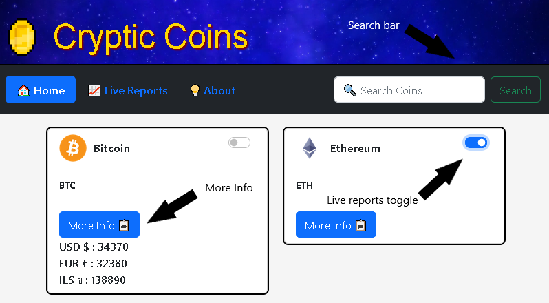
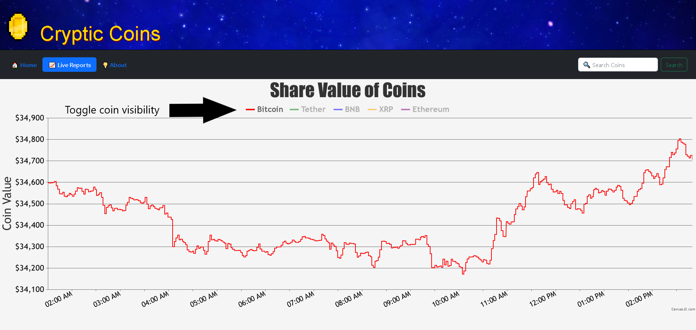
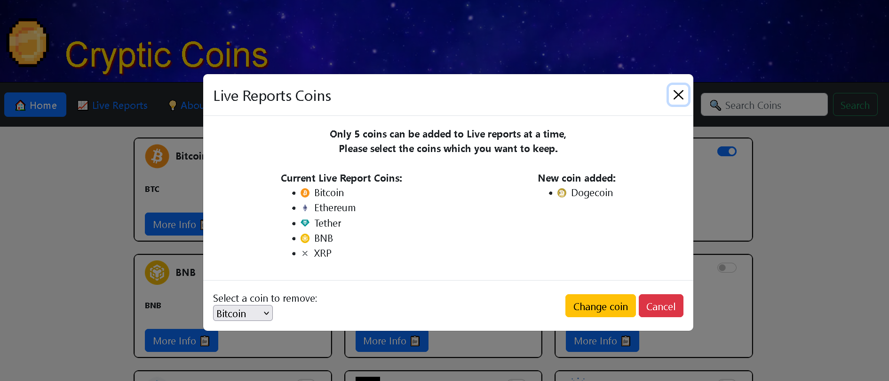

# Cryptic Coins

Hello There! Welcome to Cryptic Coins. [[Live Demo](https://www.cryptic-coins.com/)]

## General info

On the homepage, you'll find a curated list of the top 100 trending cryptocurrencies.

If you're looking for a specific coin, simply use the search bar located at the top right of the page.

For real-time information, click the 'More Info' button to see the current value of your selected cryptocurrency in USD, EUR, and ILS. To minimize API calls, this data is saved for 2 minutes.

You can also follow the value movements of your favorite coins by adding them to the Live Reports page using the toggle button on each coin card.

Up to 5 coins can be added to the Live Reports section If you attempt to add more than 5 coins, you will be prompted to either replace one of the previously added coins with the new selection or keep your current list of coins as is.

## Features

    * On the homepage you will find the top 100 cryptocurrencies.
    * Click the "More info" button to fetch the current price details from the API.
    * Search bar for searching specific coins.
    * Toggle button for the coins to be added to the live reports page.

    * Live reports page allows you to monitor the movements in their share values.
    * Up to 5 coins can be added to the Live Reports section.
    * Toggle the graph lines for each coin, making it easy to show or hide their share value trends.
    * For a closer look at a specific time period, simply click and drag your mouse over the graph to zoom in.

    * If you attempt to add more than 5 coins, you will be prompted to either replace one of the
      previously added coins with the new selection or keep your current list of coins as is.

## Technologies

- JavaScript
- JQuery
- HTML
- CSS
- Bootstrap
- Chart.js

## Setup

To run the project locally, follow these steps:

1.  Clone this repository to your local machine.
2.  Open the index.html file in your web browser.
